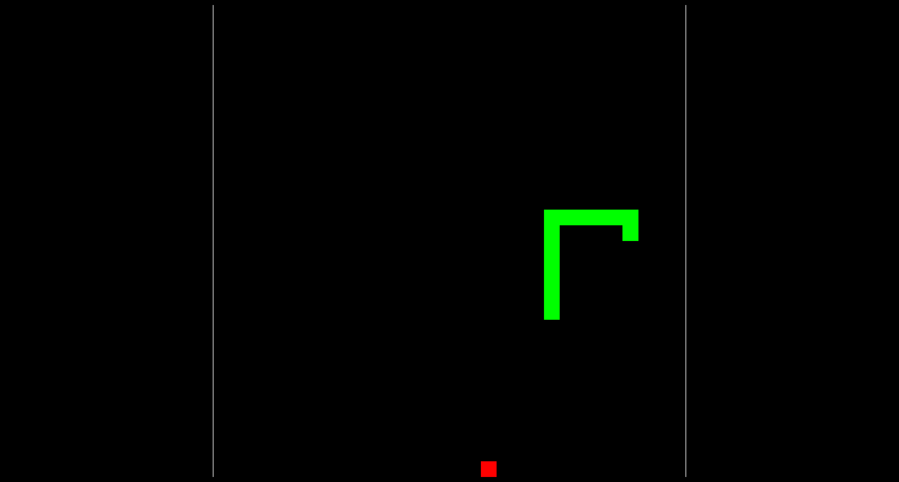

# sneker

<div align="center">
  
</div>

## How to run

```bash
git clone https://github.com/Ka-raS/sneker.git
cd sneker
python -m http.server 8000 # or `npx http-server -c-1` or meh
# open http://localhost:8000
```

## Start from Scratch

1. Download Phaser Launcher: https://phaser.io/download/phaser-launcher
2. Click "New" "Basic" Project in the Launcher
3. Follow beginner tutorial
4. ???
5. Profit

## Ghi chú

Tạo project bằng Launcher sẽ tạo `index.html`, `src/main.js`, `assets`, `phaser.js` (là source cả thư viện Phaser luôn). Tôi xoá gần hết để cho gọn dễ đọc. `index.html` sẽ include luôn `npm/phaser.js`.

> `src/main.js`:

`Phaser.Game()`: của Phaser, tạo đối tượng game

`CONFIG`: của Phaser, `CONFIG.parent` là `#id` của `<div>` trong `index.html`, khi chạy thì `<canvas>` tự đc tạo trong `<div>`.

`CONFIG.scene`: dang sách các `Phaser.Scene()`, tôi có mỗi [`Game extends Phaser.Scene`](./src/Game.js). Khi tạo project mới thì có `Boot` để load assets ảnh nhạc abc, `Preloader` để hiện thanh load game. 

Ngoài ra còn `CONFIG.physics`, có thể là `arcade`, `matter`, `impact`, `ninja` (cũ). https://docs.phaser.io/phaser/concepts/physics. Game này không dùng, sau này dùng thử.

> Thư viện Phaser

Có thể hiểu mỗi `Phaser.Scene` là một màn hình game.

Khi game chạy, Phaser gọi `constructor()` → `init()` → `preload()` → `create()` → `update()` của `Phaser.Scene`. 
- `constructor()` và `init()` thay thế nhau cũng được, `preload()` thường dùng load assets, 3 cái này chỉ gọi 1 lần
- `create()` thực ra là kiểu onEnter(), gọi mỗi khi chuyển vào màn hình này
- `update()` gọi liên tục

Thư viện có `Phaser.Math`, `Phaser.Math.Vector2`, `Phaser.GameObjects`.

`GameObjects`: hiện hình ảnh, text, sprite, bản đồ. Phaser tự vẽ, mình không cần gọi thủ công kiểu `render()`. Ae xem [`Apple extends Phaser.GameObjects.Rectangle`](./src/Apple.js)

> Template của Phaser

https://docs.phaser.io/phaser/getting-started/project-templates

Phaser có vẻ thích React Vite TypeScript. Nhưng vẫn có NextJS